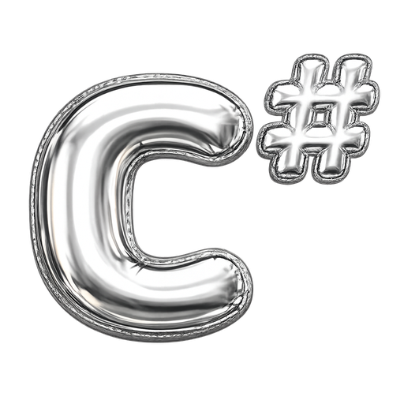

  

> [!IMPORTANT]
> **hh не участвует в проекте и не одобряет его**
>
> 

> 
<b>ru</b>

>
>  
>
> - <b>Упоминания «hh.ru», «HeadHunter» и других фирменных обозначений в материалах присутствуют только для указания темы, правообладание сохраняется за владельцами марок.</b>  
> - Материалы собраны из открытых обсуждений сообщества и воспоминаний участников, прошедших тестирование, БЕЗ обхода технических средств защиты и БЕЗ несанкционированного доступа к системам HeadHunter. <b>Материалы предоставляются в информационных и образовательных целях</b> как справочный ресурс для самоподготовки.  
> - Отдельные ссылки в материалах могут вести на связанные ресурсы, где предоставляются платные услуги. Такие <b>ссылки носят справочно-информационный характер и НЕ изменяют образовательный статус</b> самого репозитория.  
> - Каждый пользователь применяет информацию под свою ответственность.  
> - Правообладатели могут направить запрос об удалении материалов через [Issues](https://github.com/Vadim-Matsul/it-mountain-hh-verification-tests/issues/new) или [Telegram](https://t.me/vadim_matsul). Каждый запрос рассматривается индивидуально, решение о полном или частичном удалении, изменении материалов либо об отказе в удалении принимается автором с учётом действующего законодательства и обстоятельств обращения.
>
> 

>
> 

> 
<b>en</b>

>
>  
>
> - <b>Any references to "hh.ru", "HeadHunter" or other brand identifiers in the materials are used solely to indicate the subject matter; all rights to the marks are retained by their respective owners.</b>  
> - The materials have been compiled from open community discussions and recollections of participants who took the tests, WITHOUT circumventing any technical protection measures and WITHOUT unauthorized access to HeadHunter's systems. <b>The materials are provided for informational and educational purposes</b> as a reference resource for self-study.  
> - Individual links within the materials may lead to related resources that offer paid services. Such <b>links are informational and referential in nature and do NOT alter the educational status</b> of this repository.  
> - Each user applies the information at their own responsibility.  
> - Rights holders may submit a takedown request through [Issues](https://github.com/Vadim-Matsul/it-mountain-hh-verification-tests/issues/new) or [Telegram](https://t.me/vadim_matsul). Each request is reviewed individually; the decision to fully or partially remove or modify the materials, or to decline the request, is made by the author with consideration of applicable law and the circumstances of the request.
>
> 

> [!TIP]
> **Проект живёт благодаря вашим ⭐** - если материалы сэкономили вам время на подготовке, поставьте, пожалуйста, звезду репозиторию. Это не занимает и секунды, а нам показывает, что стоит продолжать пополнять базу.

  

---

  <a href="./API__.md">← API</a>
  &nbsp;·&nbsp;
  <a href="../README.md">ГЛАВНАЯ</a>
  &nbsp;·&nbsp;
  <a href="./C++__.md">C++ →</a>

  
  &nbsp;
  
  &nbsp;

<h1 align="center">
  <b>ОТВЕТЫ на тест "C#"  по навыкам и языкам HH.RU</b>
</h1>

  
  
  

 
<h2 align="center">ЧТО ЗДЕСЬ ?</h2>

- 

    <b>24/234</b> самых частых уникальных вопросов темы <b>"C#"</b> из <b>2045</b> сырых записей
  

- 

    Покрыты три уровня сложности - <b>базовый</b> · <b>средний</b> · <b>продвинутый</b>
  

- 

      Ответы верифицированы по <a href="https://learn.microsoft.com/en-us/dotnet/csharp/language-reference/"><b>C# Language Specification</b></a> и <a href="https://learn.microsoft.com/en-us/dotnet/"><b>официальной документации Microsoft .NET</b></a>
    

  <h2 align="center">ЧТО ВАЖНО ЗНАТЬ ?</h2>

- 
 HH.ru даёт только <b>1 попытку в месяц</b> - при провале возможность пройти повторно <b>будет доступна через 30 дней</b>
  

- 
 Вопросы <b>в одной попытке</b> от HH.ru <b>выбираются случайно из 200+</b> уникальных вопросов по теме <b>"C#"</b>
  

- 
 Подтверждённые навыки <b>поднимают резюме</b> в поисковой выдаче для работодателей <b>среди конкурентных откликов</b>
  

- 
 В резюме появляется официальный бейдж <b>"Навык подтверждён"</b> и HR сразу видит галочку 
  

- 
 <b>Нельзя пользоваться VPN</b> - HH.ru автоматически забракует попытку
  

- 
 <b>Нельзя делать скриншоты</b> - HH.ru видит снимки экрана и забракует попытку
  

 
<h2 align="center">
  <a href="https://it-mountain.ru/hh-tests?card=csharp">ПОЛНАЯ БАЗА С 234 ВОПРОСАМИ И МГНОВЕННЫМИ ОТВЕТАМИ</a>
</h2>

 
 
 

| #   | Вопрос                                                                                                                                                                                                                                                                                                                                                                                                                                                                                                                                                                                                                                                                                                                                                                                                                                                                                                                                                                                                                                                                                                                                                                                                                                                | Ответ                                                                                         |
| --- | ----------------------------------------------------------------------------------------------------------------------------------------------------------------------------------------------------------------------------------------------------------------------------------------------------------------------------------------------------------------------------------------------------------------------------------------------------------------------------------------------------------------------------------------------------------------------------------------------------------------------------------------------------------------------------------------------------------------------------------------------------------------------------------------------------------------------------------------------------------------------------------------------------------------------------------------------------------------------------------------------------------------------------------------------------------------------------------------------------------------------------------------------------------------------------------------------------------------------------------------------------- | --------------------------------------------------------------------------------------------- |
| 1   | Что произойдёт при выполнении кода? ReadOnlySpan&lt;char&gt; data = "hello"; data[0] = 'H';                                                                                                                                                                                                                                                                                                                                                                                                                                                                                                                                                                                                                                                                                                                                                                                                                                                                                                                                                                                                                                                                                                                                                           | `Ошибка компиляции`                                                                           |
| 2   | 

Какая конструкция приводит к ошибке компиляции?
<pre>Какая конструкция приводит к ошибке компиляции? abstract  class A {  public abstract void Do(); } class B : A { }</pre>
                                                                                                                                                                                                                                                                                                                                                                                                                                                                                                                                                                                                                                                                                                                                                                                                                                                                                                                                                                                                             | `B не реализует Do()`                                                                         |
| 3   | 

Почему следующий код вызывает исключение?
<pre>Почему следующий код вызывает исключение?  var nums = new List&lt; int&gt; {  1, 2, 3 }  ; var query = nums.Select(x =&gt; 10 / (x - 2)); var result = query.ToList();</pre>
                                                                                                                                                                                                                                                                                                                                                                                                                                                                                                                                                                                                                                                                                                                                                                                                                                                                                                                                                      | `Деление на ноль при выполнении Select`                                                       |
| 4   | Как получить размер файла в байтах?                                                                                                                                                                                                                                                                                                                                                                                                                                                                                                                                                                                                                                                                                                                                                                                                                                                                                                                                                                                                                                                                                                                                                                                                                   | `new FileInfo(path).Length`                                                                   |
| 5   | 

Вы разрабатываете .NET-проект, который использует несколько внутренних NuGet-пакетов. Все они находя...
<pre>Вы разрабатываете .NET-проект, который использует несколько внутренних NuGet-пакетов. Все они находятся в папке ./packages/. Как подключить её как источник?</pre>
                                                                                                                                                                                                                                                                                                                                                                                                                                                                                                                                                                                                                                                                                                                                                                                                                                                                                                                                  | `Добавить --source ./packages/ при установке`                                                 |
| 6   | Вы добавили новый пакет, но получаете MissingMethodException. Что произошло?                                                                                                                                                                                                                                                                                                                                                                                                                                                                                                                                                                                                                                                                                                                                                                                                                                                                                                                                                                                                                                                                                                                                                                          | `Метод был удалён в новой версии`                                                             |
| 7   | В чём особенность ограничения where T : struct?                                                                                                                                                                                                                                                                                                                                                                                                                                                                                                                                                                                                                                                                                                                                                                                                                                                                                                                                                                                                                                                                                                                                                                                                       | `Запрещает ссылочные типы`                                                                    |
| 8   | Вы создаёте обобщённый метод, в котором тип T должен иметь конструктор без параметров. Как оформить это?                                                                                                                                                                                                                                                                                                                                                                                                                                                                                                                                                                                                                                                                                                                                                                                                                                                                                                                                                                                                                                                                                                                                              | `where T : new()`                                                                             |
| 9   | Вы подписались на событие с помощью +=. Как отписаться?                                                                                                                                                                                                                                                                                                                                                                                                                                                                                                                                                                                                                                                                                                                                                                                                                                                                                                                                                                                                                                                                                                                                                                                               | `event -= handler`                                                                            |
| 10  | Почему важно использовать lock при доступе к общему ресурсу в многопоточном коде?                                                                                                                                                                                                                                                                                                                                                                                                                                                                                                                                                                                                                                                                                                                                                                                                                                                                                                                                                                                                                                                                                                                                                                     | `Чтобы синхронизировать выполнение потоков`                                                   |
| 11  | Какая форма вызова наиболее корректна для ожидания нескольких задач?                                                                                                                                                                                                                                                                                                                                                                                                                                                                                                                                                                                                                                                                                                                                                                                                                                                                                                                                                                                                                                                                                                                                                                                  | `await Task.WhenAll(task1, task2)`                                                            |
| 12  | 

Вы реализовали интерфейс IEnumerable&lt;out T&gt; в типе MyList&lt;T&gt;. Как это повлияет на использование MyList&lt;string&gt; в методе, ожидающем IEnumerable&lt;object&gt;?
<pre>Вы реализовали интерфейс IEnumerable&lt;out T&gt; в типе MyList&lt;T&gt;. Как это повлияет на использование MyList&lt;string&gt; в методе, ожидающем IEnumerable&lt;object&gt;?</pre>
                                                                                                                                                                                                                                                                                                                                                                                                                                                                                                                                                                                                                                                                                                                                                                                                                                       | `Приведение произойдёт автоматически, потому что строка наследует object`                     |
| 13  | Вы применили атрибут [Obsolete("Use NewMethod instead")] к методу OldMethod(). Какой результат будет при вызове OldMethod() из другого класса?                                                                                                                                                                                                                                                                                                                                                                                                                                                                                                                                                                                                                                                                                                                                                                                                                                                                                                                                                                                                                                                                                                        | `Вы получите предупреждение компилятора`                                                      |
| 14  | Что обозначает поколение 2 в контексте сборщика мусора?                                                                                                                                                                                                                                                                                                                                                                                                                                                                                                                                                                                                                                                                                                                                                                                                                                                                                                                                                                                                                                                                                                                                                                                               | `Для объектов, выживших много сборок`                                                         |
| 15  | Почему в .NET закреплённые (pinned) объекты замедляют работу GC?                                                                                                                                                                                                                                                                                                                                                                                                                                                                                                                                                                                                                                                                                                                                                                                                                                                                                                                                                                                                                                                                                                                                                                                      | `Их нельзя переместить в памяти`                                                              |
| 16  | 

Что выведет следующий код?
<pre>Что выведет следующий код? Span&lt;int&gt; span = stackalloc int[] { 10, 20, 30 }; span[1] = 99; Console.WriteLine(string.Join(",", span.ToArray()));</pre>
                                                                                                                                                                                                                                                                                                                                                                                                                                                                                                                                                                                                                                                                                                                                                                                                                                                                                                                                                                                                                      | `10,99,30`                                                                                    |
| 17  | 

Вы реализуете паттерн Template Method. Метод Execute() базового класса вызывает два защищённых метод...
<pre>Вы реализуете паттерн Template Method. Метод Execute() базового класса вызывает два защищённых метода - Step1() и Step2(). Метод Step1() был успешно переопределён в наследнике, но Step2() всегда вызывается из базового класса, несмотря на то, что в наследнике также объявлена его собственная версия. Рассмотрите следующий код: На мобильной платформе присутствует горизонтальный скролл кода  public class BaseProcessor {  public void Execute() {  Step1(); Step2(); // вызывается всегда из BaseProcessor } protected virtual void Step1() {  Console.WriteLine("Base Step1"); } // метод намеренно не virtual protected void Step2() {  Console.WriteLine("Base Step2"); } } public class CustomProcessor : BaseProcessor {  protected override void Step1() {  Console.WriteLine("Custom Step1"); } protected new void Step2() {  Console.WriteLine("Custom Step2"); } }  Почему при вызове Execute() используется реализация Step2() из BaseProcessor, а не из CustomProcessor?</pre>
 | `Метод Step2 не объявлен с модификатором virtual, поэтому не может быть переопределён`        |
| 18  | 

Код успешно компилируется, но при выполнении возникает IOException. Почему?
<pre>Код успешно компилируется, но при выполнении возникает IOException. Почему?  var file = File.Open("log.txt", FileMode.Open, FileAccess.ReadWrite, FileShare.None);</pre>
                                                                                                                                                                                                                                                                                                                                                                                                                                                                                                                                                                                                                                                                                                                                                                                                                                                                                                                                                | `Файл заблокирован другим процессом`                                                          |
| 19  | В методе используется ограничение where T : IDisposable. Почему вы не можете передать в него экземпляр List&lt;int&gt;?                                                                                                                                                                                                                                                                                                                                                                                                                                                                                                                                                                                                                                                                                                                                                                                                                                                                                                                                                                                                                                                                                                                               | `List<int> не реализует IDisposable`                                                          |
| 20  | Вы создаёте метод Reset&lt;T&gt;(T item), где T - любой ссылочный тип. Как указать это ограничение?                                                                                                                                                                                                                                                                                                                                                                                                                                                                                                                                                                                                                                                                                                                                                                                                                                                                                                                                                                                                                                                                                                                                                   | `where T : class`                                                                             |
| 21  | У вас есть событие ItemAdded, и вы хотите передавать объект добавленного элемента. Какой делегат использовать?                                                                                                                                                                                                                                                                                                                                                                                                                                                                                                                                                                                                                                                                                                                                                                                                                                                                                                                                                                                                                                                                                                                                        | `EventHandler<T>`                                                                             |
| 22  | Что такое race condition в многопоточном программировании?                                                                                                                                                                                                                                                                                                                                                                                                                                                                                                                                                                                                                                                                                                                                                                                                                                                                                                                                                                                                                                                                                                                                                                                            | `Ситуация, когда два потока пытаются одновременно получить доступ к одному и тому же ресурсу` |
| 23  | 

Какой метод необходимо добавить в представленный класс для реализации awaitable-типа?
<pre>Какой метод необходимо добавить в представленный класс для реализации awaitable-типа? На мобильной платформе присутствует горизонтальный скролл кода  public class CustomAwaitable : INotifyCompletion {  private bool \_isCompleted; public CustomAwaitable GetAwaiter() =&gt; this; public bool IsCompleted =&gt; \_isCompleted; public void OnCompleted(Action continuation) {  Task.Delay(1000).ContinueWith(t =&gt; {  \_isCompleted = true; continuation?.Invoke(); } ); } }</pre>
                                                                                                                                                                                                                                                                                                                                                                                                                                                                                                                                                              | `GetResult()`                                                                                 |
| 24  | Как получить все атрибуты, применённые к классу, во время выполнения?                                                                                                                                                                                                                                                                                                                                                                                                                                                                                                                                                                                                                                                                                                                                                                                                                                                                                                                                                                                                                                                                                                                                                                                 | `Через GetCustomAttributes()`                                                                 |
| ... | ...                                                                                                                                                                                                                                                                                                                                                                                                                                                                                                                                                                                                                                                                                                                                                                                                                                                                                                                                                                                                                                                                                                                                                                                                                                                   | `...`                                                                                         |
| 234 | ...                                                                                                                                                                                                                                                                                                                                                                                                                                                                                                                                                                                                                                                                                                                                                                                                                                                                                                                                                                                                                                                                                                                                                                                                                                                   | `items.Distinct()`                                                                            |

 
 
 

🔍 <b>Вы могли найти этот файл по запросам</b>

 

<i>

ответы на тест C# hh · тест c# hh ответы 2026 · hh c sharp тест ответы онлайн · подтверждение навыков c# hh.ru · hh.ru подтвердить навык c# · как подтвердить c# на hh · пройти тест c# hh · сдать тест c# hh · hh навык подтверждён c# · hh c# тест сложно · hh c# тест слитый · база ответов c# hh · hh тест c# разработчик · экзамен c# на hh · верификация c# hh · headhunter skills verification c# · headhunter c# test answers · hh c# .NET тест · тест c sharp hh

подготовка к тесту c# hh · как сдать тест c# · как пройти тест c# hh · разбор теста c# hh · шпаргалка c# hh · подготовиться к тесту c# · выучить c# для теста · база вопросов c# · сколько вопросов в тесте c# hh · какие вопросы в тесте c# · вопросы для теста c# hh 2026 · тест c# ответы pdf · c# для собеседования hh · подготовка .NET разработчика hh

.NET framework vs .NET core · .NET 8 vs .NET 6 · CLR common language runtime · IL intermediate language · JIT компиляция · AOT native · garbage collector .NET · managed heap · large object heap · gen 0 gen 1 gen 2 · finalizer · IDisposable using · using declaration · ref struct · Span<T> Memory<T> · unsafe код · pointers в C# · P/Invoke · marshalling · assembly · метаданные · reflection

value type vs reference type · struct vs class · boxing unboxing · nullable типы · nullable reference types · required members · init-only setters · records · record struct · with expression · pattern matching · switch expression · property patterns · list patterns · tuple deconstruction · anonymous types · dynamic vs object · generics · covariance contravariance · in out параметры generic · constraints where · default T

async await в C# · Task vs Task<T> · ValueTask · ConfigureAwait(false) · SynchronizationContext · deadlock async · CancellationToken · IAsyncEnumerable · await foreach · Parallel.For Parallel.ForEach · PLINQ · Thread vs Task · ThreadPool · async void опасность · Task.WhenAll Task.WhenAny · Channel<T> · Interlocked · lock statement · SemaphoreSlim · Monitor · volatile · Memory model C#

List<T> vs Array · HashSet<T> · Dictionary<TKey TValue> · SortedList · ConcurrentDictionary · ImmutableList · ReadOnlyCollection · IEnumerable vs IQueryable · deferred execution · LINQ методы · Where Select · GroupBy · Join · Aggregate · ToList vs ToArray · Distinct · OrderBy ThenBy · First FirstOrDefault · Single SingleOrDefault · Any All · yield return · IAsyncEnumerable LINQ

делегаты C# · Action Func Predicate · events · lambda выражения · expression trees · extension methods · using static · nameof · string interpolation · verbatim string @ · raw string literals """ · null-conditional ?. · null-coalescing ?? ??= · pattern matching is · switch pattern · goto case · unsafe · fixed statement · stackalloc · checked unchecked · operator overloading · implicit explicit conversion · attributes · custom attributes

наследование C# · sealed class · abstract class vs interface · default interface methods · virtual override · new modifier · protected internal · file scoped types · partial classes · partial methods · static class · nested class · finalizer destructor · IEquatable IComparable · GetHashCode Equals · ToString override · IEnumerable<T> реализация · IEnumerator

ASP.NET Core · minimal API · MVC controller · Razor Pages · Blazor Server vs WebAssembly · Kestrel · middleware pipeline · IHostBuilder · IApplicationBuilder · dependency injection ASP.NET · IServiceCollection · lifetime singleton scoped transient · configuration IOptions · Options pattern · IHttpContextAccessor · authentication authorization ASP.NET · JWT в .NET · SignalR · gRPC .NET

Entity Framework Core · Code First · DbContext · DbSet · migrations · fluent API · data annotations · lazy loading vs eager loading · Include ThenInclude · tracked untracked · AsNoTracking · IQueryable · N+1 problem EF · Dapper vs EF · connection string · SqlConnection · ADO.NET · DataReader · async EF queries

xUnit · NUnit · MSTest · Moq · NSubstitute · Assert · Theory InlineData · Fluent Assertions · code coverage · BenchmarkDotNet · Roslyn analyzers · nullable warnings · StyleCop · SonarQube .NET · integration tests · WebApplicationFactory · TestServer

hh.ru c# test answers 2026 · headhunter c sharp verification · russian job board c# certification · c# interview questions russian · dotnet interview · .net skills test · c# code quiz · asp.net core interview

как начать карьеру в it · с чего начать в it · как войти в it · войти в айти · войти в айти с нуля · как войти в it без опыта · как перейти в it из другой сферы · смена профессии на it · переквалификация в айти · сменить работу на it · переход в it после 30 · войти в it в 30 40 лет · войти в it без образования · возможно ли войти в it без вышки · как стать программистом с нуля · как научиться программировать · с чего начать программирование · программирование для начинающих · какой язык программирования выбрать новичку · какой язык программирования учить первым · с какого языка начать программировать · самый простой язык программирования · самый востребованный язык программирования 2026

как выбрать направление в it · какое направление выбрать в it · направления в it список · профессии в it · какие профессии есть в it · популярные профессии в it 2026 · востребованные профессии в it · перспективные направления в it · чем занимается frontend разработчик · чем занимается backend разработчик · чем занимается fullstack разработчик · frontend vs backend что выбрать · разница фронтенд и бэкенд · devops кто это · qa тестировщик кто это · системный аналитик · бизнес аналитик в it · project manager в it · product manager в it · scrum master кто это · data scientist кто это · machine learning инженер · разработчик мобильных приложений · ios разработчик · android разработчик · разработчик игр gamedev · веб разработчик · 1с разработчик · технический писатель

обучение it с нуля · курсы программирования · онлайн курсы it · бесплатные курсы программирования · бесплатное обучение it · платные курсы it стоит ли · яндекс практикум отзывы · skillbox отзывы · нетология отзывы · geekbrains отзывы · skillfactory отзывы · hexlet отзывы · htmlacademy · coursera · stepik · udemy · платформы для обучения программированию · сравнение it курсов · рейтинг it школ · какие курсы выбрать · что лучше самообучение или курсы · интенсивы по программированию · буткемпы it · как учиться программировать бесплатно · roadmap разработчика · roadmap frontend · roadmap backend · roadmap devops · план обучения it

сколько учиться на программиста · за сколько можно стать разработчиком · сколько нужно времени чтобы войти в it · через сколько можно найти работу junior · план обучения junior разработчика · pet project для портфолио · какие pet project делать · портфолио программиста · github портфолио · как оформить github · резюме it специалиста · резюме junior разработчик · сопроводительное письмо в it · linkedin для it · linkedin профиль разработчика

поиск работы в it · как найти первую работу в it · junior вакансии · джуниор без опыта работа · стажировки it · стажировка программистом · вакансии для новичков программирование · вакансии junior разработчик · как найти работу без опыта · как найти работу junior · сложно ли найти работу в it 2026 · рынок труда it 2026 · перенасыщение рынка it · junior не найти работу · много junior разработчиков · где искать работу разработчику · площадки для поиска работы it · hh.ru поиск работы · linkedin поиск работы · getmatch · hh vs хабр карьера · работа удалённо в it · удалённая работа программист · релокация в it · работа за границей it · работа в европе it разработчик · работа в сша it · move to eu tech · переезд в польшу разработчику · переезд в германию разработчику · переезд в португалию it · релокация в грузию · релокация в казахстан · релокация в узбекистан · релокация в аргентину · релокация в дубай it

собеседование в it · как пройти собеседование программисту · подготовка к собеседованию · как готовиться к собесу · вопросы на собеседовании junior · вопросы на собеседовании frontend · вопросы на собеседовании backend · технические вопросы на собеседовании · алгоритмические собеседования · leetcode подготовка · разбор задач с собесов · системный дизайн собеседование · system design interview · behavioral interview it · вопросы на софт скиллы · как отвечать на технические вопросы · как отвечать на поведенческие вопросы · story telling собеседование · как пройти hr собеседование · как пройти интервью с тимлидом · интервью с cto · технический скрининг · тестовое задание it · как выполнять тестовые задания · сколько времени на тестовое · договориться о зарплате it · как обсуждать зарплату · как поднять зп на новом месте · зарплатная вилка · counter offer · сколько предложить оффер · как обсуждать оффер

шпаргалка для собеседования · шпаргалка frontend · шпаргалка javascript · шпаргалка react · шпаргалка python · шпаргалка sql · как подсказки на собеседовании · как не спалиться на собесе · как использовать ai на собеседовании · chatgpt на интервью · подсказки на удалённом собесе · шпоры для собеседования · как обмануть на собеседовании · как пройти собес не зная ответов · как быстро подготовиться к собесу · собеседование за один день подготовка · собеседование через неделю · как ответить если не знаешь ответ · как выкрутиться на собеседовании · как признаться что не знаю · честность на собеседовании · искать помощь на собеседовании

hh.ru тесты навыков · подтверждение навыков hh · верификация навыков hh.ru · что такое skills verification hh · зачем проходить тесты на hh · подтверждённые навыки в резюме · как ранжируется резюме на hh · как поднять резюме на hh · как получить бейдж на hh · галочка подтверждено hh · сдать тест по javascript hh · сдать тест по python hh · как сдать тест на hh с первого раза · сложные тесты hh · провалил тест на hh · пересдать тест hh · сколько попыток тесты hh · тесты hh раз в месяц · антифрод hh · vpn на тесте hh · тесты hh 2026 обновление · какие тесты сдавать на hh · какие навыки подтверждать на hh · что даёт подтверждение навыков · увеличивает ли отклики подтверждение навыков · работает ли галочка hh · influence hh badge on views · подтверждение навыков влияет на показы · база вопросов hh · слитые тесты hh · ответы на тесты hh · как узнать вопросы hh заранее · сервисы помощи для тестов hh

менторство в it · найти ментора программиста · ментор по программированию · как выбрать ментора · getmentor · ментор junior разработчика · сколько стоит менторство · менторство отзывы · платный ментор · бесплатный ментор в it · ментор frontend · ментор backend · ментор python · ментор javascript · ментор для собеседований · подготовка с ментором · менторство vs курсы · career coaching it · карьерный консультант в it · как стать ментором · ментор для новичка · советы наставника разработчика · менторство онлайн · менторские сессии

зарплаты в it · сколько получает junior разработчик · сколько получает middle разработчик · сколько зарабатывает senior разработчик · зарплаты frontend 2026 · зарплаты backend 2026 · зарплаты devops 2026 · зарплаты qa 2026 · зарплаты data science 2026 · сколько платят программистам · сколько платят в яндексе · сколько платят в тинькофф · сколько платят в сбере · сколько платят в озон · зарплата it в москве · зарплата it в спб · зарплата it в регионах · зарплата it удалённо · зарплата it за границей · зарплата разработчика в европе · зарплата разработчика в сша · рост зарплаты программиста · как быстро расти в it · переход из junior в middle · переход из middle в senior · сколько времени между грейдами · грейды в it компаниях · система грейдов яндекс · система грейдов тинькофф · оффер сравнение · как выбрать оффер · оффер от google · оффер от faang · big tech интервью

it рынок 2026 · рынок айти россия · рынок айти после 2022 · санкции it россия · massовый релокейт it · отъезд разработчиков из россии · возвращение разработчиков в россию · сокращения в it 2026 · массовые сокращения tech · увольнения google amazon meta · tech layoffs · как влияют увольнения faang на рынок · нейросети заменят разработчиков · заменит ли ai программистов · copilot вместо разработчиков · будущее it профессий · ии в разработке · как ии меняет it · vibe coding · perspective на разработчиков · нужны ли junior в 2026 · вакансии junior сокращаются · автоматизация разработки · умрёт ли профессия программиста · что учить чтобы не заменил ии · навыки будущего в it · какие технологии учить в 2026 · тренды в разработке 2026

лучшие блоги про it · тг каналы про программирование · подкасты для разработчиков · youtube каналы про программирование · сообщества разработчиков · discord каналы it · slack комьюнити разработчиков · форумы программистов · чаты для junior разработчиков · сообщества frontend · сообщества python · сообщества backend · где общаются разработчики · как найти единомышленников в it · сетворкинг для программистов · конференции для разработчиков 2026 · митапы в москве · митапы в спб · dev.to · habr сообщество · vc.ru it · reddit r/webdev

синдром самозванца программист · выгорание разработчика · burnout in tech · как справляться с выгоранием разработчику · нервный срыв программист · депрессия у разработчиков · токсичные коллеги в it · токсичный тимлид · как жаловаться на менеджера в it · увольняться или терпеть · когда пора менять работу · признаки выгорания · как отдыхать разработчику · режим работы программиста · сон и разработка · продуктивность разработчика · pomodoro для программистов · deep work в разработке · work life balance it

курсовая по программированию · дипломная работа программирование · защита диплома it · выпускник вуза it работа · что делать после вуза it · нужно ли высшее образование программисту · вышка vs курсы · практика vs теория в it · олимпиадное программирование · icpc подготовка · codeforces · atcoder · спортивное программирование · опыт олимпиад в резюме · опыт стажировок в резюме · pet-проекты вместо опыта · open source contribution · вклад в open source · как начать контрибьютить в open source · hacktoberfest · github stars портфолио

фриланс в it · freelance для разработчиков · как начать фрилансить · биржи фриланса программиста · upwork toptal fiverr · fl.ru · freelance.ru · сколько зарабатывают фрилансеры · плюсы минусы фриланса · переход из фриланса в найм · переход из найма во фриланс · продуктовая разработка vs аутсорс · аутстафф в it · продуктовая компания vs аутсорс · галера vs продукт · большая четвёрка it · яндекс тинькофф сбер vk · т-банк it · озон it · вайлдберриз it · авито it · alfa bank tech · faang · big tech · magnificent seven

it образование за границей · магистратура cs за границей · master computer science europe · программа обучения it сша · google apprenticeship · meta internship · amazon internship · где учиться на программиста · технические вузы · вмк мгу · шад яндекс поступление · школа 21 · тинькофф академия · курсы яндекса · вкладыш от вуза · стажировки от яндекса · стажировки от тинькофф · стажировки от сбера

</i>

