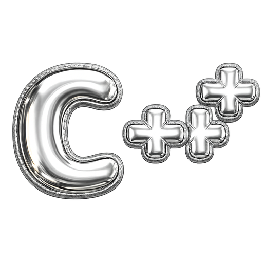

  

> [!IMPORTANT]
> **hh не участвует в проекте и не одобряет его**
>
> 

> 
<b>ru</b>

>
>  
>
> - <b>Упоминания «hh.ru», «HeadHunter» и других фирменных обозначений в материалах присутствуют только для указания темы, правообладание сохраняется за владельцами марок.</b>  
> - Материалы собраны из открытых обсуждений сообщества и воспоминаний участников, прошедших тестирование, БЕЗ обхода технических средств защиты и БЕЗ несанкционированного доступа к системам HeadHunter. <b>Материалы предоставляются в информационных и образовательных целях</b> как справочный ресурс для самоподготовки.  
> - Отдельные ссылки в материалах могут вести на связанные ресурсы, где предоставляются платные услуги. Такие <b>ссылки носят справочно-информационный характер и НЕ изменяют образовательный статус</b> самого репозитория.  
> - Каждый пользователь применяет информацию под свою ответственность.  
> - Правообладатели могут направить запрос об удалении материалов через [Issues](https://github.com/Vadim-Matsul/it-mountain-hh-verification-tests/issues/new) или [Telegram](https://t.me/vadim_matsul). Каждый запрос рассматривается индивидуально, решение о полном или частичном удалении, изменении материалов либо об отказе в удалении принимается автором с учётом действующего законодательства и обстоятельств обращения.
>
> 

>
> 

> 
<b>en</b>

>
>  
>
> - <b>Any references to "hh.ru", "HeadHunter" or other brand identifiers in the materials are used solely to indicate the subject matter; all rights to the marks are retained by their respective owners.</b>  
> - The materials have been compiled from open community discussions and recollections of participants who took the tests, WITHOUT circumventing any technical protection measures and WITHOUT unauthorized access to HeadHunter's systems. <b>The materials are provided for informational and educational purposes</b> as a reference resource for self-study.  
> - Individual links within the materials may lead to related resources that offer paid services. Such <b>links are informational and referential in nature and do NOT alter the educational status</b> of this repository.  
> - Each user applies the information at their own responsibility.  
> - Rights holders may submit a takedown request through [Issues](https://github.com/Vadim-Matsul/it-mountain-hh-verification-tests/issues/new) or [Telegram](https://t.me/vadim_matsul). Each request is reviewed individually; the decision to fully or partially remove or modify the materials, or to decline the request, is made by the author with consideration of applicable law and the circumstances of the request.
>
> 

> [!TIP]
> **Проект живёт благодаря вашим ⭐** - если материалы сэкономили вам время на подготовке, поставьте, пожалуйста, звезду репозиторию. Это не занимает и секунды, а нам показывает, что стоит продолжать пополнять базу.

 

  

---

  <a href="./C%23__.md">← C#</a>
  &nbsp;·&nbsp;
  <a href="../README.md">ГЛАВНАЯ</a>
  &nbsp;·&nbsp;
  <a href="./CSS__.md">CSS →</a>

  
  &nbsp;
  
  &nbsp;

<h1 align="center">
  <b>ОТВЕТЫ на тест "C++"  по навыкам и языкам HH.RU</b>
</h1>

  
  
  

 
<h2 align="center">ЧТО ЗДЕСЬ ?</h2>

- 

    <b>25/245</b> самых частых уникальных вопросов темы <b>"C++"</b> из <b>2483</b> сырых записей
  

- 

    Покрыты три уровня сложности - <b>базовый</b> · <b>средний</b> · <b>продвинутый</b>
  

- 

    Ответы верифицированы по <a href="https://isocpp.org/std/the-standard"><b>ISO C++ Standard</b></a> и <a href="https://en.cppreference.com/"><b>cppreference</b></a>
  

---

<h2 align="center">ЧТО ВАЖНО ЗНАТЬ ?</h2>

- 
 HH.ru даёт только <b>1 попытку в месяц</b> - при провале возможность пройти повторно <b>будет доступна через 30 дней</b>
  

- 
 Вопросы <b>в одной попытке</b> от HH.ru <b>выбираются случайно из 200+</b> уникальных вопросов по теме <b>"C++"</b>
  

- 
 Подтверждённые навыки <b>поднимают резюме</b> в поисковой выдаче для работодателей <b>среди конкурентных откликов</b>
  

- 
 В резюме появляется официальный бейдж <b>"Навык подтверждён"</b> и HR сразу видит галочку 
  

- 
 <b>Нельзя пользоваться VPN</b> - HH.ru автоматически забракует попытку
  

- 
 <b>Нельзя делать скриншоты</b> - HH.ru видит снимки экрана и забракует попытку
  

 
<h2 align="center">
  <a href="https://it-mountain.ru/hh-tests?card=cpp">ПОЛНАЯ БАЗА С 245 ВОПРОСАМИ И МГНОВЕННЫМИ ОТВЕТАМИ</a>
</h2>

 
 
 

| #   | Вопрос                                                                                                                                                                                                                                                                                                                                                                                                                                                                                                                                                                                                                                                                                                                                                       | Ответ                                                                                     |
| --- | ------------------------------------------------------------------------------------------------------------------------------------------------------------------------------------------------------------------------------------------------------------------------------------------------------------------------------------------------------------------------------------------------------------------------------------------------------------------------------------------------------------------------------------------------------------------------------------------------------------------------------------------------------------------------------------------------------------------------------------------------------------ | ----------------------------------------------------------------------------------------- |
| 1   | Какой из способов записи в файл является наиболее эффективным для бинарных данных?                                                                                                                                                                                                                                                                                                                                                                                                                                                                                                                                                                                                                                                                           | `file.write(reinterpret_cast<char*>(&num), sizeof(num))`                                  |
| 2   | 

Какое выражение должно быть на месте пропуска для корректной передачи аргумента?
<pre>Какое выражение должно быть на месте пропуска для корректной передачи аргумента? template&lt;typename T&gt; void processValue(T&amp;&amp; arg) {  // Пропущена строка } int main() {  std::string s = "Hello"; processValue(s); // lvalue processValue(std::move(s)); // rvalue }</pre>
                                                                                                                                                                                                                                                                                                       | `handleValue(std::forward<T>(arg))`                                                       |
| 3   | 

Вам нужно реализовать хранение данных для социальной сети с необходимостью обработки связей между по...
<pre>Вам нужно реализовать хранение данных для социальной сети с необходимостью обработки связей между пользователями: Быстрый поиск связей между пользователями (O(1) в среднем случае) Эффективное добавление и удаление связей (O(1)) Поддержка дополнительных данных о пользователях без дублирования. Использование какого контейнера или контейнеров позволит эффективно реализовать хранение данных?</pre>
                                                                                                                                                                                               | `std::unordered_map + std::unordered_map`                                                 |
| 4   | Какой эффект имеет ключевое слово override в C++11 и новее?                                                                                                                                                                                                                                                                                                                                                                                                                                                                                                                                                                                                                                                                                                  | `Указывает, что метод должен переопределять виртуальный метод базового класса`            |
| 5   | На рисунке ниже дана иерархия наследований в программе. Как эффективно воссоздать подобную иерархию в C++, продекларировав класс С единожды?                                                                                                                                                                                                                                                                                                                                                                                                                                                                                                                                                                                                                 | `Связать А и B общим предком и хранить указатель на этот тип в C`                         |
| 6   | 

Что выведет данный код на экран?
<pre>Что выведет данный код на экран? #include &lt;functional&gt; #include &lt;iostream&gt; int bar(int x) {  return x * 2; } void foo() {  int (*funcs[3])(int) = {   {  return x + 1; }, bar, nullptr }; auto ptr = &amp;funcs[1]; std::cout &lt;&lt; (\*ptr)(5); }</pre>
                                                                                                                                                                                                                                                                                                                                               | `10`                                                                                      |
| 7   | 

Укажите, какая строка должна быть на месте пропуска, чтобы исключение было корректно обработано и в...
<pre>Укажите, какая строка должна быть на месте пропуска, чтобы исключение было корректно обработано и в консоль было бы выведено S: class GeneralException : public std::exception {  public: virtual void print() const {  std::cout &lt;&lt; "G"; } }; class SpecialException : public GeneralException {  public: void print() const override {  std::cout &lt;&lt; "S"; } }; void f() {  throw SpecialException(); } int main() {  try {  f(); } **\_\_** catch (const SpecialException&amp; e) {  e.print(); } }</pre>
 | `catch (const GeneralException& e) { e.print(); }`                                        |
| 8   | 

Что нужно вставить в код, представленный ниже, чтобы в консоль вывелась строка «1 3»?
<pre>Что нужно вставить в код, представленный ниже, чтобы в консоль вывелась строка «1 3»? #include &lt;iostream&gt; int main() {  int x = 1, y = 1; \***\*\*\*\*\***\_\_\_\***\*\*\*\*\*** foo() ; std::cout &lt;&lt; x &lt;&lt; ” ” &lt;&lt; y &lt;&lt; std::endl; }</pre>
                                                                                                                                                                                                                                                                                                                  | `auto foo = [x, &y]() mutable { ++x; y += x; }`                                           |
| 9   | 

Код ниже не может быть скомпилирован из-за проблем с определением шаблона. Какая проблема определени...
<pre>Код ниже не может быть скомпилирован из-за проблем с определением шаблона. Какая проблема определения шаблонных функций мешает работоспособности этого решения? template&lt;class T1, class T2&gt; void f() {  std::cout &lt;&lt; “f() &lt;class T1, class T2&gt;\n”; } template&lt;&gt; void f&lt;int, int&gt;() {  std::cout &lt;&lt; “f() &lt;int, int&gt;\n”; } template&lt;class T1&gt; void f&lt;T1, double&gt;  {  std::cout &lt;&lt; “f() &lt;T1, double&gt;\n”; }</pre>
                                                                       | `Нельзя создавать частичную специализацию функции`                                        |
| 10  | 

Что будет выведено на консоль после выполнения следующего кода?
<pre>Что будет выведено на консоль после выполнения следующего кода? std::map&lt;int, char&gt; m = {{1,'a'}, {2,'b'}}; auto it = m.find(2); std::cout &lt;&lt; it-&gt;second; ++it; std::cout &lt;&lt; (it == m.end());</pre>
                                                                                                                                                                                                                                                                                                                                                                                               | `b1`                                                                                      |
| 11  | Какой тип должен быть у выражения после co_await?                                                                                                                                                                                                                                                                                                                                                                                                                                                                                                                                                                                                                                                                                                            | `Тип, для которого определен operator co_await или удовлетворяющий концепции Awaitable`   |
| 12  | Что произойдет, если не присоединить (join) или не отделить (detach) поток перед разрушением объекта std::thread?                                                                                                                                                                                                                                                                                                                                                                                                                                                                                                                                                                                                                                            | `Вызовется std::terminate`                                                                |
| 13  | 

Какое поведение ожидается из-за отсутствия синхронизации?
<pre>Какое поведение ожидается из-за отсутствия синхронизации? #include &lt;iostream&gt; #include &lt;thread&gt; int counter = 0; void increment() {  for (int i = 0; i &lt; 100000; ++i) {  ++counter; } } int main() {  std::thread t1(increment), t2(increment); t1.join(); t2.join(); std::cout &lt;&lt; counter &lt;&lt; std::endl; return 0; }</pre>
                                                                                                                                                                                                                            | `Значение counter может быть меньше 200000 из-за перекрывающихся операций`                |
| 14  | 

Выберите верное утверждение относительно работы данного кода. #include &lt;mutex&gt; #include &lt;mutex&gt; #inc...
<pre>Выберите верное утверждение относительно работы данного кода. #include &lt;mutex&gt; #include &lt;mutex&gt; #include &lt;string&gt; class SafeString {  std::string data; std::mutex mtx; // Используется обычный мьютекс public: void set(const std::string&amp; s) {  std::lock_guard&lt;std::mutex&gt; lock(mtx); data = s; } std::string get() {  std::lock_guard&lt;std::mutex&gt; lock(mtx); return data; } };</pre>
                                                                                                     | `Корректная потокобезопасная работа с данными, так как std::mutex защищает доступ к data` |
| 15  | 

Какой интринсик выполняет сравнение "больше или равно" для двух **m128d (векторов из двух double)?
<pre>Какой интринсик выполняет сравнение "больше или равно" для двух **m128d (векторов из двух double)? **m128d a = \_mm_set_pd(1.0, 2.0); **m128d b = \_mm_set_pd(2.0, 1.0); **m128d cmp = \_\_**;</pre>
                                                                                                                                                                                                                                                                                                                                                                                                    | `_mm_cmpge_pd(a, b)`                                                                      |
| 16  | 

Как правильно организовать итерирование в цикле for?
<pre>Как правильно организовать итерирование в цикле for? const std::vector&lt;int&gt; v = {1, 2, 3}; for (**\_\_**) {  std::cout &lt;&lt; x; // Ожидается: 123 }</pre>
                                                                                                                                                                                                                                                                                                                                                                                                                                                                    | `const auto& x : v`                                                                       |
| 17  | 

Выберите, что должно быть на месте пропуска, чтобы запретить переопределение метода foo для потомков...
<pre>Выберите, что должно быть на месте пропуска, чтобы запретить переопределение метода foo для потомков класса B. class A {  public: virtual void foo() const {} }; class B : public A {  public: **\_\_** }; class C : public B {  public: void foo() const override {} // Ожидается ошибка компиляции }</pre>
                                                                                                                                                                                                                                                               | `void foo() const final {}`                                                               |
| 18  | 

Проведите анализ данного кода и укажите, какие проблемы возникают в последней строке: #include &lt;memo...
<pre>Проведите анализ данного кода и укажите, какие проблемы возникают в последней строке: #include &lt;memory&gt; #include &lt;vector&gt; void foo() {  std::unique_ptr&lt;std::vector&lt;int&gt;&gt; ptr = std::make_unique&lt;std::vector&lt;int&gt;&gt;(10, 42); auto&amp; vec = \*ptr; vec.push_back(100); ptr.reset(); int x = vec.back(); // Что произойдет здесь? }</pre>
                                                                                                                                                                                | `Неопределенное поведение, так как vec - ссылка на освобожденную память`                  |
| 19  | 

Что нужно вставить в код, представленный ниже, чтобы в консоль вывелась строка «12345»?
<pre>Что нужно вставить в код, представленный ниже, чтобы в консоль вывелась строка «12345»? #include &lt;iostream&gt; #include &lt;algorithm&gt; #include &lt;vector&gt; int main() {  std::vector&lt;int&gt; v = {5, 3, 1, 4, 2}; std::sort(v.begin(), v.end(), \***\*\_\_\*\***); for (int x : v) std::cout &lt;&lt; x; }</pre>
                                                                                                                                                                                                                                                          | ` { return a < b; }`                                                      |
| 20  | 

Код ниже не может быть скомпилирован из-за проблем с определением шаблона. Какая проблема определени...
<pre>Код ниже не может быть скомпилирован из-за проблем с определением шаблона. Какая проблема определения шаблонных функций мешает работоспособности этого решения? template &lt;typename T&gt; auto calculate(T a, T b) {  return a \* b; } template &lt;typename U&gt; void display(U x) {  std::cout &lt;&lt; calculate(x, 2.5) &lt;&lt; std::endl; } int main() {  display(3); return 0; }</pre>
                                                                                                                                                               | `calculate не может вывести тип при смешивании int и double`                              |
| 21  | 

Что будет выведено на консоль после выполнения следующего кода?
<pre>Что будет выведено на консоль после выполнения следующего кода? std::vector&lt;int&gt; v = {1, 2, 3, 4}; auto it = v.begin() + 2; v.insert(it, 5); it = v.begin() + 3; std::cout &lt;&lt; \*it;</pre>
                                                                                                                                                                                                                                                                                                                                                                                                                      | `3`                                                                                       |
| 22  | Какой механизм обеспечивает атомарность операций над разделяемыми данными в C++?                                                                                                                                                                                                                                                                                                                                                                                                                                                                                                                                                                                                                                                                             | `Атомарные типы (std::atomic)`                                                            |
| 23  | 

Зачем в приведенном коде используется std::atomic?
<pre>Зачем в приведенном коде используется std::atomic? #include &lt;iostream&gt; #include &lt;thread&gt; #include &lt;atomic&gt; std::atomic&lt;int&gt; counter(0); void increment() {  for (int i = 0; i &lt; 100000; ++i) {  counter.fetch_add(1); } } int main() {  std::thread t1(increment), t2(increment); t1.join(); t2.join(); std::cout &lt;&lt; counter &lt;&lt; std::endl; return 0; }</pre>
                                                                                                                                                                             | `Использование atomic гарантирует корректное значение counter без состояния гонки`        |
| 24  | 

Выберите строку кода, которая должна быть на месте пропуска, чтобы на консоль было бы выведено 42. s...
<pre>Выберите строку кода, которая должна быть на месте пропуска, чтобы на консоль было бы выведено 42. struct Data {  int x = 42; int get() const {  return x; } }; Data d; **\_\_** std::cout &lt;&lt; (d.\*ptr)(); // Ожидается вывод: 42</pre>
                                                                                                                                                                                                                                                                                                                          | `int (Data::*ptr)() const = &Data::get`                                                   |
| 25  | 

Выберите вариант, в котором отмечены все проблемы, относящиеся к множественному наследованию. a. Нев...
<pre>Выберите вариант, в котором отмечены все проблемы, относящиеся к множественному наследованию. a. Невозможность явно наследовать несколько раз от одного класса; b. В большинстве случаев - увеличение объема кода; c. Семантическая двусмысленность, часто описываемая как Diamond of Dread; d. Наличие случаев, при которых невозможно оставаться в рамках парадигмы связывания конструктора.</pre>
                                                                                                                                                                                           | `a, c, d`                                                                                 |
| ... | ...                                                                                                                                                                                                                                                                                                                                                                                                                                                                                                                                                                                                                                                                                                                                                          | `...`                                                                                     |
| 245 | ...                                                                                                                                                                                                                                                                                                                                                                                                                                                                                                                                                                                                                                                                                                                                                          | `do { ... } while (condition)`                                                            |

 
 
 

🔍 <b>Вы могли найти этот файл по запросам</b>

 

<i>

ответы на тест C++ hh · тест c++ hh ответы 2026 · hh c++ тест ответы онлайн · подтверждение навыков c++ hh.ru · hh.ru подтвердить навык c++ · как подтвердить c++ на hh · пройти тест c++ hh · сдать тест c++ hh · hh навык подтверждён c++ · hh c++ тест сложно · hh c++ тест слитый · база ответов c++ hh · hh тест c++ разработчик · экзамен c++ на hh · верификация c++ hh · headhunter skills verification c++ · headhunter c++ test answers · russian job board c++ test · тест плюсы hh

подготовка к тесту c++ hh · как сдать тест c++ · как пройти тест c++ hh · разбор теста c++ hh · шпаргалка c++ hh · подготовиться к тесту c++ · выучить c++ для теста · база вопросов c++ · сколько вопросов в тесте c++ hh · какие вопросы в тесте c++ · вопросы для теста c++ hh 2026 · тест c++ ответы pdf · c++ для собеседования hh · подготовка plus plus разработчика

C++11 C++14 C++17 C++20 C++23 · features C++20 · concepts · ranges C++20 · coroutines C++20 · modules C++20 · std::format · std::span · designated initializers · consteval constinit · std::atomic_ref · три-way comparison · <=> оператор · spaceship operator · std::jthread · C++ ISO standard · migration from C++03 · deprecated features · language extensions

указатели C++ · сырые указатели raw pointer · nullptr vs NULL · void pointer · function pointer · smart pointers · std::unique_ptr · std::shared_ptr · std::weak_ptr · make_unique make_shared · reference counting · aliasing constructor · custom deleter · RAII · new delete · new[] delete[] · placement new · malloc vs new · alignment alignof alignas · std::aligned_storage · pointer arithmetic · dangling pointer · double free · memory leak · valgrind

std::vector · std::array · std::deque · std::list vs std::forward_list · std::map vs std::unordered_map · std::set unordered_set · std::multimap · std::stack std::queue · std::priority_queue · reserve capacity · shrink_to_fit · emplace_back vs push_back · move semantics контейнеры · custom allocator · std::pmr · итераторы · iterator invalidation · begin end cbegin · reverse iterators · random access iterator

std::sort · stable_sort · std::find find_if · std::copy transform · std::accumulate · std::for_each · std::remove_if · std::partition · std::binary_search · std::lower_bound upper_bound · std::merge · std::unique · std::rotate · execution policies · std::execution::par · std::ranges · views · lazy evaluation ranges

класс в C++ · struct vs class · конструктор · деструктор · virtual destructor · копирующий конструктор · move конструктор · Rule of Three · Rule of Five · Rule of Zero · default delete · explicit · = default = delete · initializer list constructor · std::initializer_list · наследование private protected public · множественное наследование · virtual базовый класс · diamond problem · vtable · virtual функции · pure virtual · abstract class · override final · CRTP · pimpl idiom

шаблоны C++ · template classes · template functions · specialization полная частичная · variadic templates · template parameter pack · fold expressions · SFINAE · std::enable_if · concepts requires · type traits · std::is_same · std::conditional · std::declval · perfect forwarding · std::forward · reference collapsing · universal reference · rvalue reference · move semantics · copy elision · RVO NRVO · template argument deduction · CTAD

std::thread · std::mutex · std::lock_guard · std::unique_lock · std::shared_mutex · std::condition_variable · std::async · std::future std::promise · std::packaged_task · std::atomic · memory order · memory_order_relaxed acquire release · std::atomic_flag · thread_local · std::call_once · deadlock C++ · producer consumer · false sharing · cache coherence

исключения C++ · try catch throw · noexcept · exception safety · basic strong nothrow guarantee · std::exception hierarchy · std::runtime_error · std::logic_error · rethrow · catch by reference · std::current_exception · exception specifications · std::terminate · errno · std::error_code · std::expected · std::optional

const в C++ · constexpr vs const · consteval · constinit · mutable · volatile · static местное global · static class members · inline functions · inline variables · extern C · storage duration · linkage internal external · translation unit · one definition rule ODR · anonymous namespaces · using declaration namespace · operator overloading · friend functions · friend classes · type conversion operators

hh.ru c++ test answers 2026 · headhunter cpp verification · russian job board c++ certification · c++ interview questions · modern c++ interview · templates interview · stl interview · rule of five interview

как начать карьеру в it · с чего начать в it · как войти в it · войти в айти · войти в айти с нуля · как войти в it без опыта · как перейти в it из другой сферы · смена профессии на it · переквалификация в айти · сменить работу на it · переход в it после 30 · войти в it в 30 40 лет · войти в it без образования · возможно ли войти в it без вышки · как стать программистом с нуля · как научиться программировать · с чего начать программирование · программирование для начинающих · какой язык программирования выбрать новичку · какой язык программирования учить первым · с какого языка начать программировать · самый простой язык программирования · самый востребованный язык программирования 2026

как выбрать направление в it · какое направление выбрать в it · направления в it список · профессии в it · какие профессии есть в it · популярные профессии в it 2026 · востребованные профессии в it · перспективные направления в it · чем занимается frontend разработчик · чем занимается backend разработчик · чем занимается fullstack разработчик · frontend vs backend что выбрать · разница фронтенд и бэкенд · devops кто это · qa тестировщик кто это · системный аналитик · бизнес аналитик в it · project manager в it · product manager в it · scrum master кто это · data scientist кто это · machine learning инженер · разработчик мобильных приложений · ios разработчик · android разработчик · разработчик игр gamedev · веб разработчик · 1с разработчик · технический писатель

обучение it с нуля · курсы программирования · онлайн курсы it · бесплатные курсы программирования · бесплатное обучение it · платные курсы it стоит ли · яндекс практикум отзывы · skillbox отзывы · нетология отзывы · geekbrains отзывы · skillfactory отзывы · hexlet отзывы · htmlacademy · coursera · stepik · udemy · платформы для обучения программированию · сравнение it курсов · рейтинг it школ · какие курсы выбрать · что лучше самообучение или курсы · интенсивы по программированию · буткемпы it · как учиться программировать бесплатно · roadmap разработчика · roadmap frontend · roadmap backend · roadmap devops · план обучения it

сколько учиться на программиста · за сколько можно стать разработчиком · сколько нужно времени чтобы войти в it · через сколько можно найти работу junior · план обучения junior разработчика · pet project для портфолио · какие pet project делать · портфолио программиста · github портфолио · как оформить github · резюме it специалиста · резюме junior разработчик · сопроводительное письмо в it · linkedin для it · linkedin профиль разработчика

поиск работы в it · как найти первую работу в it · junior вакансии · джуниор без опыта работа · стажировки it · стажировка программистом · вакансии для новичков программирование · вакансии junior разработчик · как найти работу без опыта · как найти работу junior · сложно ли найти работу в it 2026 · рынок труда it 2026 · перенасыщение рынка it · junior не найти работу · много junior разработчиков · где искать работу разработчику · площадки для поиска работы it · hh.ru поиск работы · linkedin поиск работы · getmatch · hh vs хабр карьера · работа удалённо в it · удалённая работа программист · релокация в it · работа за границей it · работа в европе it разработчик · работа в сша it · move to eu tech · переезд в польшу разработчику · переезд в германию разработчику · переезд в португалию it · релокация в грузию · релокация в казахстан · релокация в узбекистан · релокация в аргентину · релокация в дубай it

собеседование в it · как пройти собеседование программисту · подготовка к собеседованию · как готовиться к собесу · вопросы на собеседовании junior · вопросы на собеседовании frontend · вопросы на собеседовании backend · технические вопросы на собеседовании · алгоритмические собеседования · leetcode подготовка · разбор задач с собесов · системный дизайн собеседование · system design interview · behavioral interview it · вопросы на софт скиллы · как отвечать на технические вопросы · как отвечать на поведенческие вопросы · story telling собеседование · как пройти hr собеседование · как пройти интервью с тимлидом · интервью с cto · технический скрининг · тестовое задание it · как выполнять тестовые задания · сколько времени на тестовое · договориться о зарплате it · как обсуждать зарплату · как поднять зп на новом месте · зарплатная вилка · counter offer · сколько предложить оффер · как обсуждать оффер

шпаргалка для собеседования · шпаргалка frontend · шпаргалка javascript · шпаргалка react · шпаргалка python · шпаргалка sql · как подсказки на собеседовании · как не спалиться на собесе · как использовать ai на собеседовании · chatgpt на интервью · подсказки на удалённом собесе · шпоры для собеседования · как обмануть на собеседовании · как пройти собес не зная ответов · как быстро подготовиться к собесу · собеседование за один день подготовка · собеседование через неделю · как ответить если не знаешь ответ · как выкрутиться на собеседовании · как признаться что не знаю · честность на собеседовании · искать помощь на собеседовании

hh.ru тесты навыков · подтверждение навыков hh · верификация навыков hh.ru · что такое skills verification hh · зачем проходить тесты на hh · подтверждённые навыки в резюме · как ранжируется резюме на hh · как поднять резюме на hh · как получить бейдж на hh · галочка подтверждено hh · сдать тест по javascript hh · сдать тест по python hh · как сдать тест на hh с первого раза · сложные тесты hh · провалил тест на hh · пересдать тест hh · сколько попыток тесты hh · тесты hh раз в месяц · антифрод hh · vpn на тесте hh · тесты hh 2026 обновление · какие тесты сдавать на hh · какие навыки подтверждать на hh · что даёт подтверждение навыков · увеличивает ли отклики подтверждение навыков · работает ли галочка hh · influence hh badge on views · подтверждение навыков влияет на показы · база вопросов hh · слитые тесты hh · ответы на тесты hh · как узнать вопросы hh заранее · сервисы помощи для тестов hh

менторство в it · найти ментора программиста · ментор по программированию · как выбрать ментора · getmentor · ментор junior разработчика · сколько стоит менторство · менторство отзывы · платный ментор · бесплатный ментор в it · ментор frontend · ментор backend · ментор python · ментор javascript · ментор для собеседований · подготовка с ментором · менторство vs курсы · career coaching it · карьерный консультант в it · как стать ментором · ментор для новичка · советы наставника разработчика · менторство онлайн · менторские сессии

зарплаты в it · сколько получает junior разработчик · сколько получает middle разработчик · сколько зарабатывает senior разработчик · зарплаты frontend 2026 · зарплаты backend 2026 · зарплаты devops 2026 · зарплаты qa 2026 · зарплаты data science 2026 · сколько платят программистам · сколько платят в яндексе · сколько платят в тинькофф · сколько платят в сбере · сколько платят в озон · зарплата it в москве · зарплата it в спб · зарплата it в регионах · зарплата it удалённо · зарплата it за границей · зарплата разработчика в европе · зарплата разработчика в сша · рост зарплаты программиста · как быстро расти в it · переход из junior в middle · переход из middle в senior · сколько времени между грейдами · грейды в it компаниях · система грейдов яндекс · система грейдов тинькофф · оффер сравнение · как выбрать оффер · оффер от google · оффер от faang · big tech интервью

it рынок 2026 · рынок айти россия · рынок айти после 2022 · санкции it россия · massовый релокейт it · отъезд разработчиков из россии · возвращение разработчиков в россию · сокращения в it 2026 · массовые сокращения tech · увольнения google amazon meta · tech layoffs · как влияют увольнения faang на рынок · нейросети заменят разработчиков · заменит ли ai программистов · copilot вместо разработчиков · будущее it профессий · ии в разработке · как ии меняет it · vibe coding · perspective на разработчиков · нужны ли junior в 2026 · вакансии junior сокращаются · автоматизация разработки · умрёт ли профессия программиста · что учить чтобы не заменил ии · навыки будущего в it · какие технологии учить в 2026 · тренды в разработке 2026

лучшие блоги про it · тг каналы про программирование · подкасты для разработчиков · youtube каналы про программирование · сообщества разработчиков · discord каналы it · slack комьюнити разработчиков · форумы программистов · чаты для junior разработчиков · сообщества frontend · сообщества python · сообщества backend · где общаются разработчики · как найти единомышленников в it · сетворкинг для программистов · конференции для разработчиков 2026 · митапы в москве · митапы в спб · dev.to · habr сообщество · vc.ru it · reddit r/webdev

синдром самозванца программист · выгорание разработчика · burnout in tech · как справляться с выгоранием разработчику · нервный срыв программист · депрессия у разработчиков · токсичные коллеги в it · токсичный тимлид · как жаловаться на менеджера в it · увольняться или терпеть · когда пора менять работу · признаки выгорания · как отдыхать разработчику · режим работы программиста · сон и разработка · продуктивность разработчика · pomodoro для программистов · deep work в разработке · work life balance it

курсовая по программированию · дипломная работа программирование · защита диплома it · выпускник вуза it работа · что делать после вуза it · нужно ли высшее образование программисту · вышка vs курсы · практика vs теория в it · олимпиадное программирование · icpc подготовка · codeforces · atcoder · спортивное программирование · опыт олимпиад в резюме · опыт стажировок в резюме · pet-проекты вместо опыта · open source contribution · вклад в open source · как начать контрибьютить в open source · hacktoberfest · github stars портфолио

фриланс в it · freelance для разработчиков · как начать фрилансить · биржи фриланса программиста · upwork toptal fiverr · fl.ru · freelance.ru · сколько зарабатывают фрилансеры · плюсы минусы фриланса · переход из фриланса в найм · переход из найма во фриланс · продуктовая разработка vs аутсорс · аутстафф в it · продуктовая компания vs аутсорс · галера vs продукт · большая четвёрка it · яндекс тинькофф сбер vk · т-банк it · озон it · вайлдберриз it · авито it · alfa bank tech · faang · big tech · magnificent seven

it образование за границей · магистратура cs за границей · master computer science europe · программа обучения it сша · google apprenticeship · meta internship · amazon internship · где учиться на программиста · технические вузы · вмк мгу · шад яндекс поступление · школа 21 · тинькофф академия · курсы яндекса · вкладыш от вуза · стажировки от яндекса · стажировки от тинькофф · стажировки от сбера

</i>

