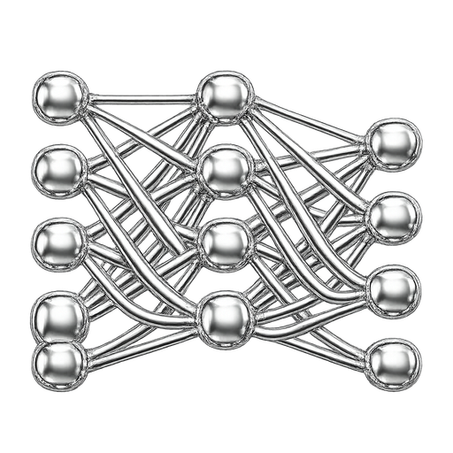

  

> [!IMPORTANT]
> **hh не участвует в проекте и не одобряет его**
>
> 

> 
<b>ru</b>

>
>  
>
> - <b>Упоминания «hh.ru», «HeadHunter» и других фирменных обозначений в материалах присутствуют только для указания темы, правообладание сохраняется за владельцами марок.</b>  
> - Материалы собраны из открытых обсуждений сообщества и воспоминаний участников, прошедших тестирование, БЕЗ обхода технических средств защиты и БЕЗ несанкционированного доступа к системам HeadHunter. <b>Материалы предоставляются в информационных и образовательных целях</b> как справочный ресурс для самоподготовки.  
> - Отдельные ссылки в материалах могут вести на связанные ресурсы, где предоставляются платные услуги. Такие <b>ссылки носят справочно-информационный характер и НЕ изменяют образовательный статус</b> самого репозитория.  
> - Каждый пользователь применяет информацию под свою ответственность.  
> - Правообладатели могут направить запрос об удалении материалов через [Issues](https://github.com/Vadim-Matsul/it-mountain-hh-verification-tests/issues/new) или [Telegram](https://t.me/vadim_matsul). Каждый запрос рассматривается индивидуально, решение о полном или частичном удалении, изменении материалов либо об отказе в удалении принимается автором с учётом действующего законодательства и обстоятельств обращения.
>
> 

>
> 

> 
<b>en</b>

>
>  
>
> - <b>Any references to "hh.ru", "HeadHunter" or other brand identifiers in the materials are used solely to indicate the subject matter; all rights to the marks are retained by their respective owners.</b>  
> - The materials have been compiled from open community discussions and recollections of participants who took the tests, WITHOUT circumventing any technical protection measures and WITHOUT unauthorized access to HeadHunter's systems. <b>The materials are provided for informational and educational purposes</b> as a reference resource for self-study.  
> - Individual links within the materials may lead to related resources that offer paid services. Such <b>links are informational and referential in nature and do NOT alter the educational status</b> of this repository.  
> - Each user applies the information at their own responsibility.  
> - Rights holders may submit a takedown request through [Issues](https://github.com/Vadim-Matsul/it-mountain-hh-verification-tests/issues/new) or [Telegram](https://t.me/vadim_matsul). Each request is reviewed individually; the decision to fully or partially remove or modify the materials, or to decline the request, is made by the author with consideration of applicable law and the circumstances of the request.
>
> 

> [!TIP]
> **Проект живёт благодаря вашим ⭐** - если материалы сэкономили вам время на подготовке, поставьте, пожалуйста, звезду репозиторию. Это не занимает и секунды, а нам показывает, что стоит продолжать пополнять базу.

 

  

---

  <a href="./Математическая_статистика__.md">← МАТ. СТАТИСТИКА</a>
  &nbsp;·&nbsp;
  <a href="../README.md">ГЛАВНАЯ</a>
  &nbsp;·&nbsp;
  <a href="./ООП__.md">ООП →</a>

  
  &nbsp;
  
  &nbsp;

<h1 align="center">
  <b>ОТВЕТЫ на тест   "МАШИННОЕ ОБУЧЕНИЕ"  по навыкам и языкам HH.RU</b>
</h1>

  
  
  

 
<h2 align="center">ЧТО ЗДЕСЬ ?</h2>

- 

    <b>24/240</b> самых частых уникальных вопросов темы <b>"МАШИННОЕ ОБУЧЕНИЕ"</b> из <b>2575</b> сырых записей
  

- 

    Покрыты три уровня сложности - <b>базовый</b> · <b>средний</b> · <b>продвинутый</b>
  

- 

    Ответы верифицированы по документации <a href="https://scikit-learn.org/stable/"><b>scikit-learn</b></a>, <a href="https://pytorch.org/docs/"><b>PyTorch</b></a> и академическим публикациям
  

---

<h2 align="center">ЧТО ВАЖНО ЗНАТЬ ?</h2>

- 
 HH.ru даёт только <b>1 попытку в месяц</b> - при провале возможность пройти повторно <b>будет доступна через 30 дней</b>
  

- 
 Вопросы <b>в одной попытке</b> от HH.ru <b>выбираются случайно из 200+</b> уникальных вопросов по теме <b>"МАШИННОЕ ОБУЧЕНИЕ"</b>
  

- 
 Подтверждённые навыки <b>поднимают резюме</b> в поисковой выдаче для работодателей <b>среди конкурентных откликов</b>
  

- 
 В резюме появляется официальный бейдж <b>"Навык подтверждён"</b> и HR сразу видит галочку 
  

- 
 <b>Нельзя пользоваться VPN</b> - HH.ru автоматически забракует попытку
  

- 
 <b>Нельзя делать скриншоты</b> - HH.ru видит снимки экрана и забракует попытку
  

 
<h2 align="center">
  <a href="https://it-mountain.ru/hh-tests?card=machine_learning">ПОЛНАЯ БАЗА С 240 ВОПРОСАМИ И МГНОВЕННЫМИ ОТВЕТАМИ</a>
</h2>

 
 
 

| #   | Вопрос                                                                                                                                                                                                                                                                                                                                                                                                                                                   | Ответ                                                                                                                               |
| --- | -------------------------------------------------------------------------------------------------------------------------------------------------------------------------------------------------------------------------------------------------------------------------------------------------------------------------------------------------------------------------------------------------------------------------------------------------------- | ----------------------------------------------------------------------------------------------------------------------------------- |
| 1   | 

В задаче бинарной классификации выбраны две модели: первая показывает высокую точность (Precision),...
<pre>В задаче бинарной классификации выбраны две модели: первая показывает высокую точность (Precision), вторая - высокую полноту (Recall). Что можно сказать об их поведении на данных при равных остальных условиях?</pre>
                                                                                 | `Модель с высокой точностью делает меньше ложных срабатываний`                                                                      |
| 2   | Как можно обнаружить проблему недообучения в модели линейной регрессии?                                                                                                                                                                                                                                                                                                                                                                                  | `Модель показывает низкую точность как на обучающих, так и на тестовых данных`                                                      |
| 3   | Вы применяете логистическую регрессию к задаче многоклассовой классификации с настройками по умолчанию. Как поведёт себя модель в этом случае?                                                                                                                                                                                                                                                                                                           | `Модель автоматически перейдёт к использованию softmax и кросс-энтропии, либо One-vs-Rest`                                          |
| 4   | 

Линейный дискриминантный анализ предполагает, что классы имеют одинаковые ковариационные матрицы. Ка...
<pre>Линейный дискриминантный анализ предполагает, что классы имеют одинаковые ковариационные матрицы. Какие последствия могут возникнуть, если это предположение нарушено?</pre>
                                                                                                                           | `Модель может построить неэффективную границу, ухудшая классификацию`                                                               |
| 5   | Почему построение оптимального решающего дерева - сложная задача, и какой альтернативный подход можно использовать для её упрощения?                                                                                                                                                                                                                                                                                                                     | `Полный перебор всех возможных структур дерева вычислительно сложен, поэтому используют жадные алгоритмы, строящие дерево поэтапно` |
| 6   | 

Какие последствия могут возникнуть при использовании наивного байесовского классификатора на разреже...
<pre>Какие последствия могут возникнуть при использовании наивного байесовского классификатора на разреженных данных, содержащих редкие, но значимые признаки?</pre>
                                                                                                                                        | `Метод может недооценить влияние редких признаков, что приведет к снижению точности классификации`                                  |
| 7   | 

В задаче классификации используется метод k-ближайших соседей (k-NN). Почему в реальных датасетах мо...
<pre>В задаче классификации используется метод k-ближайших соседей (k-NN). Почему в реальных датасетах может возникать неравномерная плотность объектов в разных зонах признакового пространства?</pre>
                                                                                                     | `Из-за того, что данные могут формироваться из разных групп или иметь разную природу`                                               |
| 8   | 

Вы рассматриваете использование метода опорных векторов (SVM) для классификации. Данные содержат мно...
<pre>Вы рассматриваете использование метода опорных векторов (SVM) для классификации. Данные содержат много выбросов, а граница между классами размыта. Как можно охарактеризовать поведение метода SVM в такой ситуации?</pre>
                                                                             | `Метод с мягким зазором позволяет частично учитывать выбросы и лучше работает при пересечении классов`                              |
| 9   | Почему интерпретируемость случайного леса (Random Forest) значительно ниже по сравнению с одиночным деревом?                                                                                                                                                                                                                                                                                                                                             | `Ансамбль из сотен деревьев не дает единой четкой логики принятия решений, усредняя множество сложных правил`                       |
| 10  | Вы разрабатываете рекомендательную систему для видеосервиса. Какой из подходов поможет учитывать предпочтения пользователя в реальном времени?                                                                                                                                                                                                                                                                                                           | `Внедрение онлайн-обучения на основе последних взаимодействий`                                                                      |
| 11  | Какой недостаток решетчатого поиска особенно проявляется при увеличении числа гиперпараметров?                                                                                                                                                                                                                                                                                                                                                           | `Время вычислений резко увеличивается при росте размерности пространства`                                                           |
| 12  | Для сильно зашумленных данных: сигнал y = sin(x) + ε, где ε нормально распределенный шум N(0, 0.1). Какой метод позволит найти оценку производной?                                                                                                                                                                                                                                                                                                       | `Применить сглаживание сплайнами с последующим численным дифференцированием`                                                        |
| 13  | Какое влияние оказывает высокое смещение (bias) на поведение модели в задачах машинного обучения?                                                                                                                                                                                                                                                                                                                                                        | `Модель недообучается и плохо отражает структуру данных`                                                                            |
| 14  | Вы хотите отобрать признаки для модели с помощью дерева решений. Как можно это сделать, используя структуру самой модели?                                                                                                                                                                                                                                                                                                                                | `Оценить важность признаков по количеству использований в разбиениях`                                                               |
| 15  | 

Необходимо провести классификацию 10 тысяч документов с учетом тематической структуры требуется выде...
<pre>Необходимо провести классификацию 10 тысяч документов с учетом тематической структуры требуется выделить скрытые темы. Какой метод лучше подходит для этой задачи?</pre>
                                                                                                                               | `Latent Dirichlet Allocation (LDA) + логистическая регрессия`                                                                       |
| 16  | 

В задаче регрессии функцию потерь, измеряющую отклонение предсказанных значений A(x) от правильных з...
<pre>В задаче регрессии функцию потерь, измеряющую отклонение предсказанных значений A(x) от правильных значений y, изменили: вместо квадрата разности (A(x) – y)² стали использовать абсолютное значение разности \|A(x) – y\|. Как изменится поведение модели при обучении с такой функцией потерь?</pre>
 | `Снизится чувствительность к выбросам`                                                                                              |
| 17  | 

Вы применяете линейную регрессию к задаче, где зависимость между переменными имеет ярко выраженную э...
<pre>Вы применяете линейную регрессию к задаче, где зависимость между переменными имеет ярко выраженную экспоненциальную форму. Какой эффект вероятнее всего наблюдается при этом?</pre>
                                                                                                                    | `Модель будет плохо аппроксимировать зависимость из-за линейной формы`                                                              |
| 18  | 

Вы обучили логистическую регрессию и заметили, что один из признаков имеет крайне большое значение к...
<pre>Вы обучили логистическую регрессию и заметили, что один из признаков имеет крайне большое значение коэффициента при сравнительно низкой значимости. Что может быть причиной такого поведения модели?</pre>
                                                                                             | `Признаки могут быть скоррелированы, что вызывает нестабильность оценок коэффициентов`                                              |
| 19  | 

Каковы возможные последствия применения линейного дискриминантного анализа с регуляризацией для зада...
<pre>Каковы возможные последствия применения линейного дискриминантного анализа с регуляризацией для задачи с большим числом признаков и малым числом выборок?</pre>
                                                                                                                                        | `Метод снизит вероятность переобучения, обобщая данные за счет уменьшения размерности`                                              |
| 20  | 

Дерево решений показывает хорошие результаты на обучении, но низкое качество на валидации. Применени...
<pre>Дерево решений показывает хорошие результаты на обучении, но низкое качество на валидации. Применение процедуры обрезки (pruning) помогает исправить ситуацию. Почему это работает?</pre>
                                                                                                              | `Обрезка удаляет переобученные ветви дерева, улучшая обобщающую способность`                                                        |
| 21  | Наивный байесовский классификатор предполагает независимость признаков. Что может произойти, если на практике признаки окажутся скоррелированными?                                                                                                                                                                                                                                                                                                       | `Классификатор может давать смещённые вероятности, что снизит качество предсказаний`                                                |
| 22  | Метод k-NN применён к задаче с высокой размерностью признаков. Модель показывает низкое качество. Как можно объяснить это поведение?                                                                                                                                                                                                                                                                                                                     | `В условиях "проклятия размерности" расстояния между точками теряют информативность`                                                |
| 23  | 

При использовании ядра радиальной базисной функции (RBF) в SVM наблюдается очень высокая точность на...
<pre>При использовании ядра радиальной базисной функции (RBF) в SVM наблюдается очень высокая точность на обучающей выборке и заметно худшее качество на тестовой. Что это может означать?</pre>
                                                                                                            | `Модель переобучилась, так как RBF-ядро может подстраиваться под отдельные точки`                                                   |
| 24  | Почему метод случайного леса считается менее склонным к переобучению, чем отдельное дерево решений?                                                                                                                                                                                                                                                                                                                                                      | `Каждое дерево обучается на случайных данных и признаках`                                                                           |
| ... | ...                                                                                                                                                                                                                                                                                                                                                                                                                                                      | `...`                                                                                                                               |
| 240 | ...                                                                                                                                                                                                                                                                                                                                                                                                                                                      | `Плохо работает при сильной корреляции признаков`                                                                                   |

 
 
 

🔍 <b>Вы могли найти этот файл по запросам</b>

 

<i>

ответы на тест Машинное обучение hh · тест ML hh ответы 2026 · hh машинное обучение тест ответы онлайн · подтверждение навыков ML hh.ru · hh.ru подтвердить навык машинное обучение · как подтвердить ML на hh · пройти тест ML hh · сдать тест машинное обучение hh · hh навык подтверждён ML · hh машинное обучение тест сложно · база ответов ML hh · hh тест data scientist · экзамен ML на hh · верификация machine learning hh · headhunter skills verification machine learning · тест ML разработчик hh

подготовка к тесту ML hh · как сдать тест машинное обучение · как пройти тест ML hh · разбор теста ML hh · шпаргалка ML hh · подготовиться к тесту машинное обучение · выучить ML для теста · база вопросов ML · сколько вопросов в тесте ML hh · какие вопросы в тесте машинное обучение · вопросы для теста ML hh 2026 · ML для собеседования hh · data scientist interview prep

supervised learning · unsupervised learning · reinforcement learning · semi-supervised · self-supervised · classification vs regression · binary vs multi-class · multi-label classification · training set test set · validation set · train test split · cross-validation · k-fold CV · stratified CV · leave-one-out · time series split · overfitting · underfitting · bias variance tradeoff · high bias vs high variance · learning curves · training accuracy vs validation accuracy · feature engineering · feature selection · feature scaling · normalization vs standardization

linear regression · gradient descent · stochastic gradient descent SGD · mini-batch GD · momentum · learning rate · cost function · MSE mean squared error · MAE · RMSE · logistic regression · sigmoid function · log loss cross-entropy · one-vs-rest one-vs-one · softmax multi-class · regularization L1 L2 · ridge regression · lasso regression · elastic net · closed-form solution · normal equation · maximum likelihood

decision tree · classification tree regression tree · Gini impurity · entropy information gain · pruning деревьев · pre-pruning post-pruning · random forest · bagging · out-of-bag OOB error · feature importance · gradient boosting · GBDT · XGBoost · LightGBM · CatBoost · AdaBoost · stacking · voting · hard voting soft voting · boosting vs bagging · overfitting в деревьях

accuracy precision recall F1-score · confusion matrix · true positive false positive · classification report · ROC curve · AUC-ROC · PR curve · precision-recall trade-off · MSE MAE RMSE · R-squared · log loss · mean average precision MAP · IoU intersection over union · specificity sensitivity · Matthews correlation coefficient MCC · Cohen's kappa · balanced accuracy · class imbalance · macro micro weighted average

препроцессинг данных · missing values imputation · SimpleImputer · KNNImputer · mean median mode imputation · outlier detection · IQR method · Z-score outliers · categorical encoding · one-hot encoding · label encoding · ordinal encoding · target encoding · frequency encoding · binary encoding · feature scaling · MinMaxScaler StandardScaler RobustScaler · PowerTransformer · normalization · log transform · feature engineering · polynomial features · interaction features · feature crosses · date/time features · text features TF-IDF

clustering · K-means · elbow method · silhouette score · K-means++ · mini-batch K-means · hierarchical clustering · agglomerative divisive · dendrogram · DBSCAN · epsilon min_samples · OPTICS · mean shift · Gaussian Mixture Models GMM · EM algorithm · spectral clustering · dimensionality reduction · PCA principal component analysis · explained variance · t-SNE · UMAP · autoencoder · manifold learning · Isomap · LLE

нейронная сеть · perceptron · multi-layer perceptron MLP · feedforward network · backpropagation · chain rule · activation functions · ReLU · Leaky ReLU · sigmoid tanh · softmax · GELU · Swish · loss functions · MSE cross-entropy · batch normalization · layer normalization · dropout · early stopping · weight initialization · Xavier Glorot He initialization · vanishing exploding gradients · residual connections · skip connections · convolutional networks CNN · pooling layers · max avg pooling · recurrent networks RNN · LSTM · GRU · sequence-to-sequence · attention mechanism · transformers · self-attention · BERT · GPT · fine-tuning · transfer learning · pretrained models · embedding layers

regularization ML · L1 L2 penalty · dropout · early stopping · data augmentation · batch size · learning rate scheduling · learning rate warmup · Adam optimizer · RMSprop · Adagrad · momentum · Nesterov · AdamW · label smoothing · mixup · gradient clipping · weight decay · hyperparameter tuning · grid search · random search · Bayesian optimization · Optuna · Hyperopt · Ray Tune

scikit-learn · sklearn Pipeline · GridSearchCV · RandomizedSearchCV · TensorFlow · Keras · PyTorch · JAX · pandas numpy · matplotlib seaborn · plotly · XGBoost LightGBM CatBoost · statsmodels · Hugging Face transformers · fastai · PyTorch Lightning · MLflow · Weights and Biases wandb · TensorBoard · DVC data version control · Kaggle · Google Colab · Jupyter · CUDA GPU · CuPy · Numba

hh.ru machine learning test answers 2026 · headhunter ML verification · russian job board ML certification · machine learning interview questions · deep learning interview · sklearn interview · neural network interview · overfitting interview

как начать карьеру в it · с чего начать в it · как войти в it · войти в айти · войти в айти с нуля · как войти в it без опыта · как перейти в it из другой сферы · смена профессии на it · переквалификация в айти · сменить работу на it · переход в it после 30 · войти в it в 30 40 лет · войти в it без образования · возможно ли войти в it без вышки · как стать программистом с нуля · как научиться программировать · с чего начать программирование · программирование для начинающих · какой язык программирования выбрать новичку · какой язык программирования учить первым · с какого языка начать программировать · самый простой язык программирования · самый востребованный язык программирования 2026

как выбрать направление в it · какое направление выбрать в it · направления в it список · профессии в it · какие профессии есть в it · популярные профессии в it 2026 · востребованные профессии в it · перспективные направления в it · чем занимается frontend разработчик · чем занимается backend разработчик · чем занимается fullstack разработчик · frontend vs backend что выбрать · разница фронтенд и бэкенд · devops кто это · qa тестировщик кто это · системный аналитик · бизнес аналитик в it · project manager в it · product manager в it · scrum master кто это · data scientist кто это · machine learning инженер · разработчик мобильных приложений · ios разработчик · android разработчик · разработчик игр gamedev · веб разработчик · 1с разработчик · технический писатель

обучение it с нуля · курсы программирования · онлайн курсы it · бесплатные курсы программирования · бесплатное обучение it · платные курсы it стоит ли · яндекс практикум отзывы · skillbox отзывы · нетология отзывы · geekbrains отзывы · skillfactory отзывы · hexlet отзывы · htmlacademy · coursera · stepik · udemy · платформы для обучения программированию · сравнение it курсов · рейтинг it школ · какие курсы выбрать · что лучше самообучение или курсы · интенсивы по программированию · буткемпы it · как учиться программировать бесплатно · roadmap разработчика · roadmap frontend · roadmap backend · roadmap devops · план обучения it

сколько учиться на программиста · за сколько можно стать разработчиком · сколько нужно времени чтобы войти в it · через сколько можно найти работу junior · план обучения junior разработчика · pet project для портфолио · какие pet project делать · портфолио программиста · github портфолио · как оформить github · резюме it специалиста · резюме junior разработчик · сопроводительное письмо в it · linkedin для it · linkedin профиль разработчика

поиск работы в it · как найти первую работу в it · junior вакансии · джуниор без опыта работа · стажировки it · стажировка программистом · вакансии для новичков программирование · вакансии junior разработчик · как найти работу без опыта · как найти работу junior · сложно ли найти работу в it 2026 · рынок труда it 2026 · перенасыщение рынка it · junior не найти работу · много junior разработчиков · где искать работу разработчику · площадки для поиска работы it · hh.ru поиск работы · linkedin поиск работы · getmatch · hh vs хабр карьера · работа удалённо в it · удалённая работа программист · релокация в it · работа за границей it · работа в европе it разработчик · работа в сша it · move to eu tech · переезд в польшу разработчику · переезд в германию разработчику · переезд в португалию it · релокация в грузию · релокация в казахстан · релокация в узбекистан · релокация в аргентину · релокация в дубай it

собеседование в it · как пройти собеседование программисту · подготовка к собеседованию · как готовиться к собесу · вопросы на собеседовании junior · вопросы на собеседовании frontend · вопросы на собеседовании backend · технические вопросы на собеседовании · алгоритмические собеседования · leetcode подготовка · разбор задач с собесов · системный дизайн собеседование · system design interview · behavioral interview it · вопросы на софт скиллы · как отвечать на технические вопросы · как отвечать на поведенческие вопросы · story telling собеседование · как пройти hr собеседование · как пройти интервью с тимлидом · интервью с cto · технический скрининг · тестовое задание it · как выполнять тестовые задания · сколько времени на тестовое · договориться о зарплате it · как обсуждать зарплату · как поднять зп на новом месте · зарплатная вилка · counter offer · сколько предложить оффер · как обсуждать оффер

шпаргалка для собеседования · шпаргалка frontend · шпаргалка javascript · шпаргалка react · шпаргалка python · шпаргалка sql · как подсказки на собеседовании · как не спалиться на собесе · как использовать ai на собеседовании · chatgpt на интервью · подсказки на удалённом собесе · шпоры для собеседования · как обмануть на собеседовании · как пройти собес не зная ответов · как быстро подготовиться к собесу · собеседование за один день подготовка · собеседование через неделю · как ответить если не знаешь ответ · как выкрутиться на собеседовании · как признаться что не знаю · честность на собеседовании · искать помощь на собеседовании

hh.ru тесты навыков · подтверждение навыков hh · верификация навыков hh.ru · что такое skills verification hh · зачем проходить тесты на hh · подтверждённые навыки в резюме · как ранжируется резюме на hh · как поднять резюме на hh · как получить бейдж на hh · галочка подтверждено hh · сдать тест по javascript hh · сдать тест по python hh · как сдать тест на hh с первого раза · сложные тесты hh · провалил тест на hh · пересдать тест hh · сколько попыток тесты hh · тесты hh раз в месяц · антифрод hh · vpn на тесте hh · тесты hh 2026 обновление · какие тесты сдавать на hh · какие навыки подтверждать на hh · что даёт подтверждение навыков · увеличивает ли отклики подтверждение навыков · работает ли галочка hh · influence hh badge on views · подтверждение навыков влияет на показы · база вопросов hh · слитые тесты hh · ответы на тесты hh · как узнать вопросы hh заранее · сервисы помощи для тестов hh

менторство в it · найти ментора программиста · ментор по программированию · как выбрать ментора · getmentor · ментор junior разработчика · сколько стоит менторство · менторство отзывы · платный ментор · бесплатный ментор в it · ментор frontend · ментор backend · ментор python · ментор javascript · ментор для собеседований · подготовка с ментором · менторство vs курсы · career coaching it · карьерный консультант в it · как стать ментором · ментор для новичка · советы наставника разработчика · менторство онлайн · менторские сессии

зарплаты в it · сколько получает junior разработчик · сколько получает middle разработчик · сколько зарабатывает senior разработчик · зарплаты frontend 2026 · зарплаты backend 2026 · зарплаты devops 2026 · зарплаты qa 2026 · зарплаты data science 2026 · сколько платят программистам · сколько платят в яндексе · сколько платят в тинькофф · сколько платят в сбере · сколько платят в озон · зарплата it в москве · зарплата it в спб · зарплата it в регионах · зарплата it удалённо · зарплата it за границей · зарплата разработчика в европе · зарплата разработчика в сша · рост зарплаты программиста · как быстро расти в it · переход из junior в middle · переход из middle в senior · сколько времени между грейдами · грейды в it компаниях · система грейдов яндекс · система грейдов тинькофф · оффер сравнение · как выбрать оффер · оффер от google · оффер от faang · big tech интервью

it рынок 2026 · рынок айти россия · рынок айти после 2022 · санкции it россия · massовый релокейт it · отъезд разработчиков из россии · возвращение разработчиков в россию · сокращения в it 2026 · массовые сокращения tech · увольнения google amazon meta · tech layoffs · как влияют увольнения faang на рынок · нейросети заменят разработчиков · заменит ли ai программистов · copilot вместо разработчиков · будущее it профессий · ии в разработке · как ии меняет it · vibe coding · perspective на разработчиков · нужны ли junior в 2026 · вакансии junior сокращаются · автоматизация разработки · умрёт ли профессия программиста · что учить чтобы не заменил ии · навыки будущего в it · какие технологии учить в 2026 · тренды в разработке 2026

лучшие блоги про it · тг каналы про программирование · подкасты для разработчиков · youtube каналы про программирование · сообщества разработчиков · discord каналы it · slack комьюнити разработчиков · форумы программистов · чаты для junior разработчиков · сообщества frontend · сообщества python · сообщества backend · где общаются разработчики · как найти единомышленников в it · сетворкинг для программистов · конференции для разработчиков 2026 · митапы в москве · митапы в спб · dev.to · habr сообщество · vc.ru it · reddit r/webdev

синдром самозванца программист · выгорание разработчика · burnout in tech · как справляться с выгоранием разработчику · нервный срыв программист · депрессия у разработчиков · токсичные коллеги в it · токсичный тимлид · как жаловаться на менеджера в it · увольняться или терпеть · когда пора менять работу · признаки выгорания · как отдыхать разработчику · режим работы программиста · сон и разработка · продуктивность разработчика · pomodoro для программистов · deep work в разработке · work life balance it

курсовая по программированию · дипломная работа программирование · защита диплома it · выпускник вуза it работа · что делать после вуза it · нужно ли высшее образование программисту · вышка vs курсы · практика vs теория в it · олимпиадное программирование · icpc подготовка · codeforces · atcoder · спортивное программирование · опыт олимпиад в резюме · опыт стажировок в резюме · pet-проекты вместо опыта · open source contribution · вклад в open source · как начать контрибьютить в open source · hacktoberfest · github stars портфолио

фриланс в it · freelance для разработчиков · как начать фрилансить · биржи фриланса программиста · upwork toptal fiverr · fl.ru · freelance.ru · сколько зарабатывают фрилансеры · плюсы минусы фриланса · переход из фриланса в найм · переход из найма во фриланс · продуктовая разработка vs аутсорс · аутстафф в it · продуктовая компания vs аутсорс · галера vs продукт · большая четвёрка it · яндекс тинькофф сбер vk · т-банк it · озон it · вайлдберриз it · авито it · alfa bank tech · faang · big tech · magnificent seven

it образование за границей · магистратура cs за границей · master computer science europe · программа обучения it сша · google apprenticeship · meta internship · amazon internship · где учиться на программиста · технические вузы · вмк мгу · шад яндекс поступление · школа 21 · тинькофф академия · курсы яндекса · вкладыш от вуза · стажировки от яндекса · стажировки от тинькофф · стажировки от сбера

</i>

